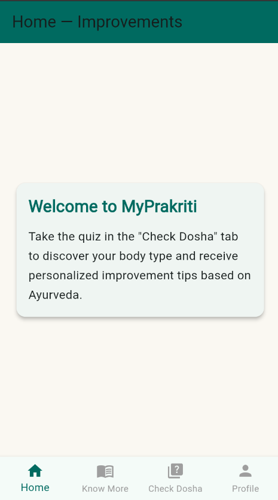
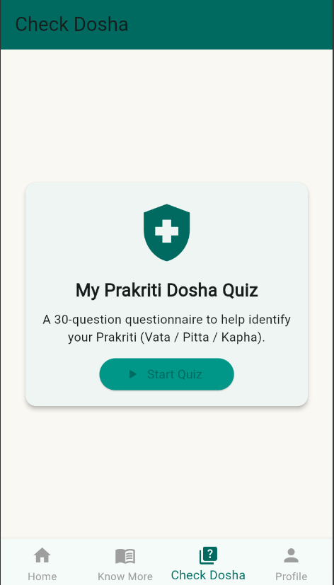
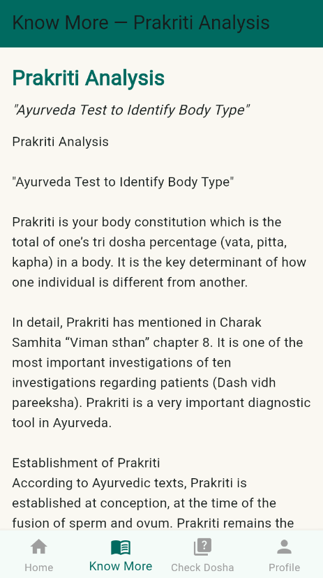

# 🌿 MyPrakriti — Ayurveda Dosha Quiz App

## 🧘 Project Description
**MyPrakriti** is a Flutter-based mobile application designed to help users identify their **Ayurvedic body constitution (Prakriti)** — **Vata**, **Pitta**, or **Kapha** — through a 30-question interactive quiz.

The app provides:
- Personalized **Prakriti (Dosha) analysis**
- Ayurvedic **lifestyle and diet improvement tips**
- **Theme switching** (Light/Natural & Dark/Earthy)
- **Profile management** with user info (Name, Email, Dosha)
- Educational content about Ayurveda and Prakriti

---

## ⚙️ Installation Steps

### 1. Install Flutter SDK
- Download Flutter from the official site: [https://flutter.dev/docs/get-started/install](https://flutter.dev/docs/get-started/install)
- Verify the installation:
  ```bash
  flutter doctor
  ```

### 2. Clone this Repository
```bash
git clone https://github.com/<your-username>/myprakriti.git
```

### 3. Navigate to the Project Directory
```bash
cd myprakriti
```

### 4. Get Dependencies
```bash
flutter pub get
```

---

## ▶️ How to Run the App

### Option 1 — Run on Emulator or Connected Device
```bash
flutter run
```

### Option 2 — Build a Release APK
```bash
flutter build apk --release
```
The APK will be generated at:
```
build/app/outputs/flutter-apk/app-release.apk
```

---

## 🧭 How to Use the App

1. Launch the **MyPrakriti App** on your phone or emulator.  
2. Enter your **Name** and **Email** on the login screen.  
3. Explore the following tabs:
   - 🏠 **Home:** Ayurvedic lifestyle improvement tips.  
   - 📖 **Know More:** Learn about Ayurveda, Tridosha, and Prakriti.  
   - 🧩 **Check Dosha:** 30-question quiz to determine your Dosha type.  
   - 👤 **Profile:** View user details, toggle theme, and logout.

---

## 📁 Project Main Structure

```
myprakriti/
├── lib/
│   └── main.dart          # Complete Flutter app source code
├── pubspec.yaml            # Project dependencies
├── README.md               # Documentation file
└── assets/                 # (Optional) images, icons, fonts, etc.
```

---

## 🌗 Some Features Overview

| Feature | Description |
|----------|-------------|
| 🔐 **Login Screen** | Simple local form to collect name and email |
| 🧩 **Dosha Quiz** | 30-question interactive quiz |
| 📊 **Result Calculation** | Determines user's dominant Dosha (Vata, Pitta, or Kapha) |
| 🌿 **Know More Section** | Educational Ayurveda and Tridosha information |
| 🏠 **Home Tab** | Personalized tips for lifestyle and diet |
| 👤 **Profile Tab** | Displays user data and Dosha result |
| 💡 **Theme Switcher** | Toggle between Light and Dark themes |

---

## 📸 Screenshots

### 🏠 Home Screen


### 🧩 Dosha Quiz


### Know More


### 👤 Profile Page


More photos are on the screenshots foldler  
---

## 👨‍💻 Developed By

**Shivam Maisuriya**  
IHWP Project — 2025  
Email: *maisuriyas89@gmail.com*  

---

✅ *“Know your Prakriti, Balance your Life.”*
